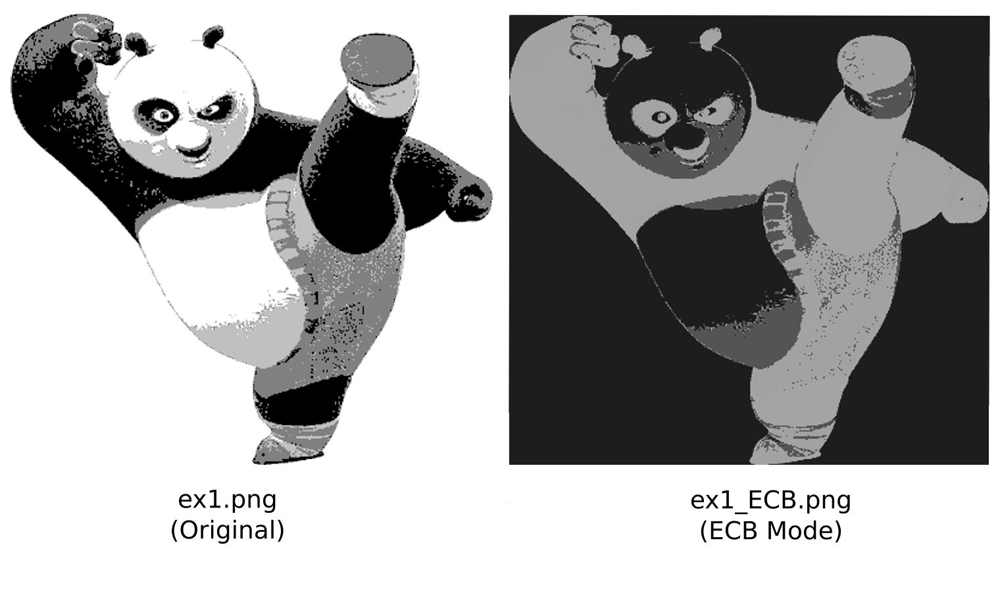

## Usage

* Make sure you have `res/` folder in the same directory with `325pa1.jar` for the resource path to work.

1) Run 325pa1.jar
   ```
   java -jar 325pa1.jar
   ```
2) Compile sources & run
   ```
   cd ./src
   javac *.java
   java Main
   ```
3) Create JAR file & run
   ```
   cd ./src
   javac *.java
   jar -cvfm 325pa1.jar META-INF/MANIFEST.MF *.class
   java -jar 325pa1.jar
   ```
   And copy `res/` folder to the jar directory or vice-versa.

---

## Results
### Input files:
* ex1.png: 400x375 PNG image of a panda using 2bpp (4 grays) colors.
* ex2.png: 1500x1796 PNG image of a cat using 2bpp (4 grays) colors.

---

\

\
\
\
\
\


### Output files:
#### ECB Mode
* ex1_ECB.png: ECB Encrypted version of ex1.png, still resembles the original image because the pixels are encrypted individually.
  
* ex2_ECB.png: ECB Encrypted version of ex2.png, still resembles the original image because the pixels are encrypted individually.
  

\
\

#### CBC Mode
* ex2_CBC.png: CBC Encrypted version of ex1.png, looks nothing like the original image because encryption data is fed back into itself (chaining)
  
* ex2_CBC.png: CBC Encrypted version of ex2.png, looks nothing like the original image because encryption data is fed back into itself (chaining)
   
